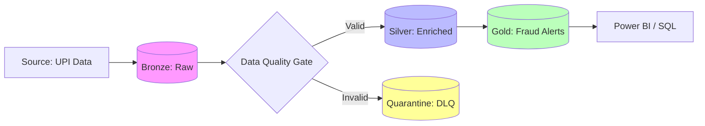

# Enterprise AML Compliance & Fraud Detection Framework
**Unified Data Engineering on Microsoft Fabric**


## Project Strategy
In the banking sector, data is a liability if not governed correctly. This project demonstrates a production-grade **Anti-Money Laundering (AML)** pipeline built on the **Microsoft Fabric SaaS platform**. 
---

## 🏗️ Architecture: The Medallion + Quarantine Pattern
I have implemented a highly resilient **Medallion Architecture** that prioritizes data integrity through a custom **Dead Letter Queue (Quarantine)** pattern.



## Project Proof & Results

### 1. Data Ingestion & Quality Control
I purposefully "poisoned" the Bronze layer with invalid records (negative amounts, fake UPI IDs) to test the robustness of the **Quarantine Pattern**.

| Bronze: Raw & Poisoned | Silver: Quarantine (DLQ) |
| :--- | :--- |
|  |  |
| *Raw data with intentional anomalies.* | *Records isolated with 'error_reason' metadata.* |

### 2. Data Engineering Excellence (SCD Type 2)
The Silver layer tracks every historical change. Notice the `Is_active` flag and `Effective_End` dates, which provide a 100% accurate audit trail for compliance.


### 3. Fraud Detection (Gold) & Governance (RLS)
The final Gold table identifies "Smurfing" patterns. Using **Row-Level Security**, we ensure an auditor only sees data for their assigned district.

| Gold: PMLA Fraud Alerts | SQL: RLS Filtered Result |
| :--- | :--- |
|  |  |
| *Users flagged for high-velocity transactions.* | *Filtered view: Auditor sees ONLY Chennai data.* |

---

## 📁 Repository Structure
```text
├── notebooks/          # PySpark logic: Ingestion, SCD2, Fraud Analytics
├── sql/                # RLS Functions and Security Policies (T-SQL)
├── docs/screenshots/   # Proof of Work (Success logs & tables)
└── README.md           # Documentation
