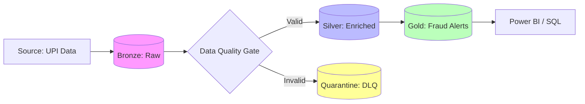

# Enterprise AML Compliance & Fraud Detection Framework
**Unified Data Engineering on Microsoft Fabric**

# Project Stratergy
In the banking sector, data is a liability if not governed correctly. This project demonstrates a production-grade **Anti-Money Laundering (AML)** pipeline built on the **Microsoft Fabric SaaS platform**. 

## Architecture: The Medallion + Quarantine Pattern
I have implemented a highly resilient **Medallion Architecture** that prioritizes data integrity through a custom **Dead Letter Queue (Quarantine)** pattern.



## Technical Proof of Work (Verified in Microsoft Fabric)

Below are the verified results of each pipeline stage, demonstrating the successful handling of data ingestion, quality enforcement, and jurisdictional security.

### 1. Raw Ingestion & Data Poisoning (Bronze)
To validate the resilience of the Data Quality Gate, I purposefully "poisoned" the Bronze layer with invalid records (negative amounts and malformed UPI handles).

| Bronze: Raw Base Table | Bronze: Poisoned Records (Anomalies) |
| :--- | :--- |
|  |  |

---

### 2. The Quarantine & Silver Layer Sync
I implemented a **Dead Letter Queue (DLQ)** pattern. Notice how the Silver layer maintains the historical SCD Type 2 records while the malformed data is isolated for audit.

| Silver: SCD2 History & Quarantine Log | Silver: Production-Ready (Clean) Data |
| :--- | :--- |
|  |  |
| *Tracking changes while isolating bad records.* | *High-quality data ready for downstream analytics.* |

---

### 3. Gold Analytics & Regional Governance (RLS)
The final stage identifies high-risk "Smurfing" patterns. Row-Level Security ensures that the final result is dynamically filtered based on the auditor's assigned jurisdiction.

**Detected PMLA Fraud Alerts (Gold):**


**Security Enforcement (Auditor Mapping & Result):**
| Auditor-District Mapping | Filtered Result (The "Proof") |
| :--- | :--- |
|  |  |
| *Entra ID-based access control mapping.* | *The 'Chennai Auditor' view: Filtered Result.* |

---

## Repository Structure
```text
├── notebooks/          # PySpark logic: Ingestion, SCD2, Fraud Analytics
├── sql/                # RLS Functions and Security Policies (T-SQL)
├── design docs/        # Architecture diagrams and Screenshots
└── README.md           # Documentation
```

## Lets Connect !

[](www.linkedin.com/in/madhumithaviswanathan)

**Role:**  Data Engineer | Microsoft Fabric Certified  
**Focus:** Enterprise Data Architecture & Financial Compliance
